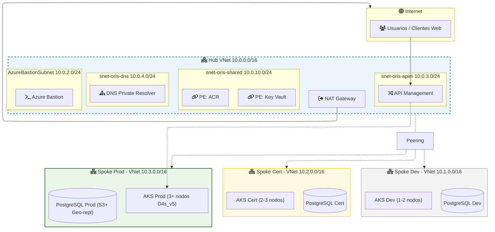

# Documento de Arquitectura de Software (DAS) - ORIS

**Proyecto:** Observatorio Regional de Indicadores Sociales (ORIS) - Gobierno Regional de Cusco
**Versión:** 1.0
**Fecha:** Febrero 2026
**Autor:** Equipo de Desarrollo ORIS
**Estado:** En desarrollo - Primer Hito

---

## Índice

1. [Introducción y Finalidad](#1-introducci%C3%B3n-y-finalidad)
2. [Representación de la Arquitectura](#2-representaci%C3%B3n-de-la-arquitectura)
3. [Vista Lógica (Componentes)](#3-vista-l%C3%B3gica-componentes)
4. [Vista de Desarrollo (Implementación)](#4-vista-de-desarrollo-implementaci%C3%B3n)
5. [Vista de Proceso](#5-vista-de-proceso)
6. [Vista Física (Despliegue)](#6-vista-f%C3%ADsica-despliegue)
7. [Escenarios (Casos de Uso)](#7-escenarios-casos-de-uso)
8. [Seguridad](#8-seguridad)
9. [Gobernanza y Gestión de Recursos Azure](#9-gobernanza-y-gesti%C3%B3n-de-recursos-azure)
10. [Infraestructura como Código y CI/CD](#10-infraestructura-como-c%C3%B3digo-y-cicd)
11. [Observabilidad](#11-observabilidad)
12. [Glosario](#12-glosario)

---

## 1. Introducción y Finalidad

### 1.1 Propósito del Documento
Este Documento de Arquitectura de Software (DAS) describe la arquitectura técnica del **Observatorio Regional de Indicadores Sociales (ORIS)** para el Gobierno Regional de Cusco. El DAS es el "Manual del Constructor" del software: explica cómo está construido el sistema por dentro para que sea seguro, rápido y fácil de mantener. En el contexto de licitaciones públicas, este documento asegura al Estado que no se está entregando una "caja negra" que nadie podrá arreglar después.

### 1.2 Alcance
El ORIS tiene como objetivo el cierre de brechas sociales en las 13 provincias y 116 distritos de la Región Cusco, abarcando las 6 unidades funcionales:
* **Mujer** - Indicadores de igualdad de género
* **Discapacidad** - Registro y seguimiento de personas con discapacidad
* **Adulto Mayor** - Programas de atención al adulto mayor
* **Niño y Adolescente** - Indicadores de bienestar infantil
* **Juventud** - Programas de desarrollo juvenil
* **Pueblo Indígena** - Indicadores de comunidades originarias

### 1.3 Alcance del Primer Hito
El primer hito se centra en el **Servicio Central de Autenticación (CAS)** que provee:
* Autenticación mediante JWT RS256
* Autorización basada en roles y permisos (RBAC)
* Autenticación multifactor (MFA) con TOTP
* Gestión de usuarios, roles y permisos
* Infraestructura base en Azure Kubernetes Service (AKS)

### 1.4 Modelo Arquitectónico
Se utiliza el Modelo 4+1 de Vistas de Philippe Kruchten para documentar la arquitectura desde cinco perspectivas complementarias:

| Vista | Describe | Audiencia |
|-------|----------|-----------|
| **Vista Lógica** | Funcionalidad dividida en componentes | Desarrolladores, Arquitectos |
| **Vista de Desarrollo** | Organización del código fuente | Desarrolladores |
| **Vista de Proceso** | Interacción entre componentes en tiempo de ejecución | Desarrolladores, QA |
| **Vista Física** | Dónde se ejecuta el software (infraestructura) | DevOps, Operaciones |
| **Escenarios** | Uso del sistema desde la perspectiva del usuario | Stakeholders, QA |

---

## 2. Representación de la Arquitectura

### 2.1 Estilo Arquitectónico
El sistema utiliza una arquitectura de microservicios con las siguientes características:
* **Microservicios independientes:** Cada dominio de negocio se implementa como un servicio independiente.
* **Contenedores Docker:** Cada microservicio se empaqueta como una imagen Docker.
* **Orquestación con Kubernetes (AKS):** Los contenedores se despliegan y gestionan en Azure Kubernetes Service.
* **API Gateway centralizado:** Azure API Management gestiona el tráfico entrante, rate limiting y validación inicial.
* **Comunicación síncrona REST:** Los microservicios exponen APIs REST documentadas con OpenAPI 3.0.

### 2.2 Stack Tecnológico

| Capa | Tecnología | Justificación |
|------|-----------|---------------|
| **Backend** | Spring Boot 4.0 + WebFlux | Framework reactivo de alto rendimiento, soporte nativo para R2DBC |
| **Frontend** | Angular 17 | Framework SPA robusto para aplicaciones de gobierno |
| **Base de Datos** | PostgreSQL 14 | Relacional robusta con soporte para UUID, JSON y alta concurrencia |
| **Acceso a Datos** | R2DBC (reactivo) + Flyway | Acceso no bloqueante a BD con migraciones versionadas |
| **Seguridad** | JWT RS256 + TOTP MFA | Autenticación sin estado, firmada asimétricamente |
| **Contenedores** | Docker + AKS | Portabilidad, escalabilidad horizontal |
| **IaC** | Terraform | Infraestructura declarativa, reproducible y versionada |
| **GitOps** | ArgoCD + Kustomize | Despliegue continuo declarativo con auto-sincronización |
| **CI/CD** | GitHub Actions | Integración y despliegue automatizado |
| **Observabilidad** | OpenTelemetry + Azure Application Insights + Azure Monitor | Trazas, métricas y logs en Azure Monitor (PaaS, cero pods de observabilidad en AKS) |
| **API Contract** | OpenAPI 3.0 (Contract-First) | APIs definidas antes de implementar, generación automática de interfaces |

### 2.3 Principios de Diseño
* **Clean Architecture:** Separación estricta en capas (Domain, Application, Infrastructure).
* **Contract-First API:** La API se define en OpenAPI antes de codificar.
* **Reactive Stack:** Todo el stack es no bloqueante (Mono/Flux).
* **Infrastructure as Code:** Toda la infraestructura se define en Terraform.
* **GitOps:** El estado deseado de Kubernetes se declara en Git.
* **Zero Trust:** CAS maneja toda la autenticación y autorización dentro del clúster.

---

## 3. Vista Lógica (Componentes)

La vista lógica muestra la descomposición funcional del sistema en componentes y sus relaciones.

### 3.1 Capa de Entrada
| Componente | Función |
|------------|---------|
| **Application Gateway (WAF v2)** | Protección contra ataques web (OWASP Top 10), terminación TLS 1.3 |
| **API Management** | Rate limiting, validación de JWT, transformación de requests, documentación de API |
| **Ingress Controller (NGINX)** | Enrutamiento interno dentro del clúster AKS |

### 3.2 Microservicios

**oris-cas-central (Servicio de Autenticación Central)**
Único microservicio implementado en el primer hito, que reemplaza la necesidad de Azure Entra ID:
* **Autenticación JWT RS256:** Emisión y validación de tokens con firma asimétrica (pública/privada).
* **Autorización RBAC:** Control de acceso basado en roles (SUPER_ADMIN, ADMIN, GOBIERNO_LOCAL, UNIDAD_FUNCIONAL) y permisos granulares.
* **MFA TOTP:** Autenticación 2FA con códigos de 6 dígitos, ventana de 30s.
* **Gestión de Usuarios, Roles y Permisos:** CRUD completo.

**Microservicios Futuros (uno por Unidad Funcional):**
* `oris-business-mujer` - Indicadores de igualdad de género (Planificado)
* `oris-business-discapacidad` - Registro de personas con discapacidad (Planificado)
* `oris-business-adulto-mayor` - Atención al adulto mayor (Planificado)
* `oris-business-nino-adolescente` - Bienestar infantil y adolescente (Planificado)
* `oris-business-juventud` - Desarrollo juvenil (Planificado)
* `oris-business-pueblo-indigena` - Comunidades originarias (Planificado)

### 3.3 Capa de Datos y Observabilidad
* **Azure PostgreSQL Flexible Server:** Almacenamiento relacional.
* **Azure Key Vault:** Almacenamiento seguro de claves JWT RS256 y secretos.

**Stack de Observabilidad Azure-Native:**
* **OpenTelemetry Java Agent:** Instrumentación automática adjunta al JAR.
* **Azure Application Insights:** Trazas, logs y métricas de aplicación.
* **Azure Monitor / Log Analytics:** Telemetría de infraestructura, métricas de AKS.
* **Container Insights:** Métricas y logs de nodos/pods AKS.
*(Justificación: Elimina carga operativa de mantener pods de observabilidad en AKS, proporcionando correlación nativa).*

---

## 4. Vista de Desarrollo (Implementación)

### 4.1 Estructura del Proyecto
El microservicio `oris-cas-central` sigue Clean Architecture:
```text
src/main/java/pe/gob/regioncusco/oris/business/oriscascentral/
├── domain/            # Capa de Dominio (sin dependencias de Spring)
├── application/       # Capa de Aplicación (lógica de negocio)
└── infrastructure/    # Capa de Infraestructura (Spring, BD, seguridad)
```

### 4.2 Capa de Dominio (domain/)
* **Entidades:** `OriUser` (ori_user), `Role` (ori_role), `Permission` (ori_permission), `UserRole`, `RolePermission`.
* **Excepciones de Negocio:** `InvalidCredentialsException` (401), `ForbiddenException` (403), `RateLimitExceededException` (429), etc.

### 4.3 Capa de Aplicación (application/)
* **Servicios:** `AuthService`, `JwtService`, `MfaService`, `RbacService`, `UserService`.
* **DTOs:** `JwtClaims`, `LoginResult`, `MfaSetupResult`, `TokenPair`.

### 4.4 Capa de Infraestructura (infrastructure/)
* **Controllers (OpenAPI-generated):** `AuthController`, `MfaApiImpl`, `UserApiImpl`, `RbacApiImpl`.
* **Seguridad:** `SecurityConfig` (SecurityFilterChain), `JwtAuthenticationConverter`, `JwtReactiveAuthenticationManager`, `MfaVerificationFilter`.
* **Repositorios (R2DBC):** `OriUserRepository`, `RoleRepository`, `PermissionRepository`, etc.

### 4.5 Desarrollo Contract-First y Patrones
1. Definir endpoint en `src/main/resources/openapi.yml`.
2. Generar interfaces con `mvnw clean compile`.
3. Implementar la interfaz en un Controller e inyectar dependencias.
* **Patrones Aplicados:** SOLID, DTO, Repository, Mapper, Filter Chain.

---

## 5. Vista de Proceso

### 5.1 Flujos Principales
* **Flujo de Autenticación (Login):**
  App -> WAF -> APIM -> Ingress -> CAS pod. `AuthService` busca en PostgreSQL -> Valida BCrypt -> Obtiene Roles (`RbacService`) -> Genera Token RS256 (`JwtService`). Si MFA está activado retorna `mfaRequired: true`.
* **Flujo de Registro de Usuario:**
  * **Por Administrador:** (POST `/admin/users`) Requiere permiso `user:create`. Asigna roles.
  * **Público:** (POST `/auth/register`) Asigna rol automático `GOBIERNO_LOCAL`.
* **Flujo de Refresh Token:** Sliding Window. Renueva token de acceso y token de refresh si expira en < 2 días.

---

## 6. Vista Física (Despliegue)

### 6.1 Topología de Red Hub-Spoke

* **Hub VNet (10.0.0.0/16):** Servicios compartidos (APIM, DNS, Bastion, ACR, Key Vault).
* **VNet Peering:** Hub <-> Spoke bidireccional, sin peering entre spokes para aislamiento.
* **Private Endpoints:** Todo servicio PaaS se acede vía red privada sin salida a internet público.
* **Egress:** Centralizado vía NAT Gateway en el Hub.

### 6.2 Ambientes de Despliegue
| Ambiente | AKS Nodos | PostgreSQL Tier | Réplicas CAS |
|----------|-----------|-----------------|--------------|
| **Dev** | 1-2 burstable | Basic/S0 | 1 |
| **Cert** | 2-3 nodos | Igual a prod | 2 |
| **Prod** | 3+ Standard_D4s_v5 | S3+ geo-replication | 3 (HPA) |

---

## 7. Escenarios (Casos de Uso)

### 7.1 Actores
* **SUPER_ADMIN:** Acceso total.
* **ADMIN:** Permisos de gestión.
* **GOBIERNO_LOCAL:** Funcionario de los 116 distritos.
* **UNIDAD_FUNCIONAL:** Funcionario de las 6 U. F.

### 7.2 Casos de Uso
* **Ingreso:** Valida credenciales -> solicita MFA TOTP -> Redirige al dashboard territorial.
* **Creación de Usuario:** Admin asigna datos y rol `GOBIERNO_LOCAL` a un nuevo perfil.
* **Desactivar Cuenta:** Modificación de status a `INACTIVE` por Admin (Endpoint `PATCH /admin/users/{id}/status`).
* **Futuros:** Registro de indicadores por parte de U.Funcional; visualización de dashboard comparativo a nivel departamental.

---

## 8. Seguridad

### 8.1 JWT RS256 y MFA TOTP
* **JWT RS256:** Firma asimétrica (RSA-2048). Access Token de 15 min, Refresh Token de 7 días. La clave privada solo la posee CAS, permitiendo que futuros servicios verifiquen el token con la pública de manera independiente.
* **MFA TOTP:** Códigos de 6 dígitos cada 30 segundos (via Google Auth/Authy). Endpoints `/mfa/setup`, `/mfa/validate`, `/mfa/enable`.

### 8.2 Control de Acceso y Red
* **Filtros WebFlux:** `CORS Filter` -> `JWT Authentication Filter` -> `MFA Verification Filter` -> `Method Security` (@PreAuthorize).
* **RBAC:** Roles macro (`SUPER_ADMIN`, `GOBIERNO_LOCAL`) resolviendo hacia permisos granulares como `user:create`, `role:write`, `indicator:write`.
* **Perímetro Azure:** WAF v2 en Ingress, APIM para Rate Limit, NSGs por subred, conexiones por Private Endpoint.

---

## 9. Gobernanza y Gestión de Recursos Azure

Configuración de jerarquía y principios de "Mínimo Viable":
* **Management Groups:** `oris-gobcusco` (Políticas Globales) -> `oris-platform`, `oris-nonprod`, `oris-prod`.
* **Subscripciones Aisladas:** Para prevenir el "blast radius" entre ambientes.
* **Etiquetado (Tags):** Obligatorias (`environment`, `project`, `owner`, `cost-center`, `managed-by=terraform`).
* **Nomenclatura:** `{tipo}-oris-{env}-{funcion}-{region}` (Ej: `rg-oris-prod-aks-brse`).

---

## 10. Infraestructura como Código y CI/CD

### 10.1 Repositorios y GitOps
* `oris-business-cas-central-v2`: Código java. Maven + Docker -> GitHub Actions.
* `oris-infrastructure`: Terraform. Ejecutado vía GitHub Actions.
* `oris-gitops`: Kustomize + ArgoCD. El estado de la infraestructura Kubernetes se declara aquí.

### 10.2 Terraform en Capas
1. `01-platform`: Hub VNet, APIM, ACR, KV, Log Analytics.
2. `02-networking`: Spoke VNets, Peering, NSG, NAT.
3. `03-data`: PostgreSQL, PE.
4. `04-compute`: AKS Clusters.
5. `05-observability`: App Insights, Azure Monitor.

### 10.3 Workflows
* **Microservicio:** Push a main -> Compila, Test, Docker Build, Push a ACR -> Se actualiza TAG en el repo de `oris-gitops`.
* **GitOps:** ArgoCD detecta la actualización en el repo GitOps y auto-sincroniza en AKS dev. Pasa de dev->cert->prod vía Pull Requests y validaciones.

---

## 11. Observabilidad

### 11.1 Arquitectura de Observabilidad
* **No hay pods de observabilidad en AKS:** Se utilizan servicios gestionados Azure.
* **Instrumentación:** OpenTelemetry Java Agent (adjunto vía `-javaagent`).
* **Telemetría W3C:** APIM envía header `traceparent` -> Microservicio OTel Agent propaga trace a BD -> Todo llega consolidado a **Azure Application Insights**.
* **Container Insights:** Exporta métricas/logs nativos de K8s a **Log Analytics Workspace**.

### 11.2 Desarrollo Local
El framework permite configuración pura localmente:
```bash
OTEL_TRACES_EXPORTER=logging
OTEL_METRICS_EXPORTER=logging
OTEL_LOGS_EXPORTER=logging
```
Permitiendo ver trazas completas por consola sin necesitar acceso a Azure.

---

## 12. Glosario

| Término | Definición |
|---------|------------|
| AKS / ACR / APIM | Azure Kubernetes Service / Azure Container Registry / Azure API Management. |
| ArgoCD / Kustomize | Herramientas declarativas para despliegues GitOps K8s. |
| BCrypt | Algoritmo de hashing para contraseñas. |
| CAS | Central Authentication Service. |
| Clean Architecture | Patrón de arquitectura enfocado en la separación e independencia de capas. |
| HPA / PDB | Horizontal Pod Autoscaler / Pod Disruption Budget (K8s). |
| JWT RS256 | JSON Web Token validado mediante firma asimétrica de 2048 bits. |
| R2DBC / WebFlux | Reactive Relational Database Connectivity y el framework reactivo de Spring. |
| WAF | Web Application Firewall. |

---
*Gobierno Regional de Cusco - Gerencia de Inclusión Social, Mujer y Poblaciones Vulnerables.*
