# METODOLOGÍA DE DESARROLLO DE SOFTWARE
## Observatorio Regional de Indicadores Sociales (ORIS)
### Gobierno Regional de Cusco — Gerencia de Inclusión Social, Mujer y Poblaciones Vulnerables

---

| Campo | Detalle |
|---|---|
| **Proyecto** | Observatorio Regional de Indicadores Sociales (ORIS) |
| **Cliente** | Gobierno Regional de Cusco |
| **Versión** | 1.0 |
| **Fecha** | Febrero 2026 |
| **Metodología** | Scrum + Modelo 4+1 |
| **Cronograma** | 100 días calendario |
| **Estado** | En ejecución — Hito 1 |

---

## ÍNDICE

1. [Descripción de Procesos de Negocio, Módulos y Requerimientos](#1-descripcion)
2. [Listado de Casos de Uso con Diagramas y Actores](#2-casos-de-uso)
3. [Metodología Scrum — Burndown y Sprints](#3-scrum)
4. [Matriz de Roles y Accesos](#4-roles-accesos)

---

## 1. DESCRIPCIÓN DE PROCESOS DE NEGOCIO, MÓDULOS Y REQUERIMIENTOS {#1-descripcion}

### 1.1 Contexto del Negocio

El **Observatorio Regional de Indicadores Sociales (ORIS)** es una plataforma web institucional del Gobierno Regional de Cusco cuyo propósito es **centralizar, procesar y visualizar** los indicadores sociales de los 116 distritos y 13 provincias de la Región Cusco. La plataforma habilita a las 6 Unidades Funcionales a alimentar indicadores que faciliten la toma de decisiones para el cierre de brechas sociales bajo el proyecto MISIONAL.

### 1.2 Procesos de Negocio

Los procesos de negocio del ORIS se organizan en tres macroprocesos:

#### MACROPROCESO 1 — Gestión de Acceso y Seguridad

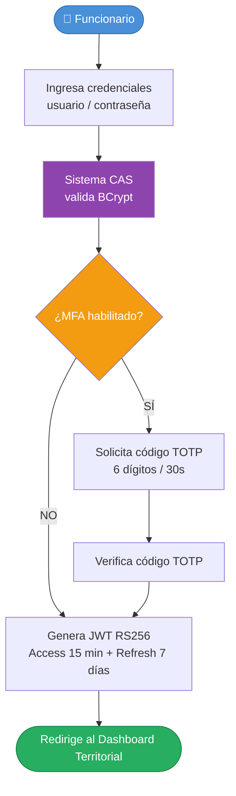

#### MACROPROCESO 2 — Registro y Gestión de Indicadores Sociales

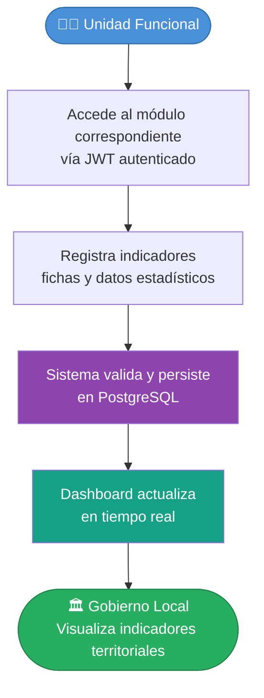

#### MACROPROCESO 3 — Reportes y Toma de Decisiones

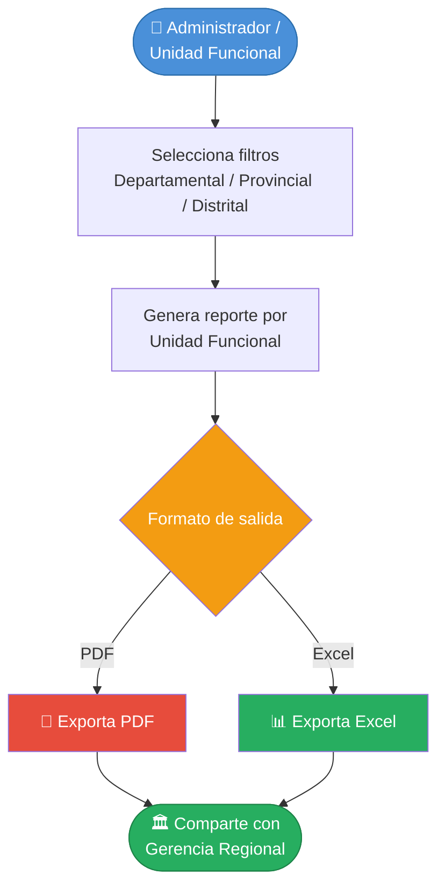

---

### 1.3 Módulos del Sistema

El sistema ORIS se estructura en **10 módulos principales** distribuidos en dos capas: infraestructura y negocio.

#### MÓDULO 0 — Servicio Central de Autenticación (CAS)
> **Microservicio:** `oris-cas-central` | **Estado:** Implementado (Hito 1)

Gestiona toda la autenticación y autorización del ecosistema ORIS:
- Autenticación JWT RS256 (Access Token 15 min / Refresh Token 7 días)
- Autorización RBAC con roles macros y permisos granulares
- Autenticación Multifactor (MFA TOTP — Google Authenticator / Authy)
- CRUD de Usuarios, Roles y Permisos
- API Gateway: Rate Limiting, validación de tokens, transformación de requests

#### MÓDULO 1 — Tablero Observatorio Regional
> **Microservicio:** `oris-business-core` | **Estado:** Planificado (Hito 2)

Vista principal del observatorio con:
- Panel de control con indicadores consolidados a nivel Departamental, Provincial y Distrital
- Mapa interactivo de los 116 distritos con capas de indicadores
- Filtros por Unidad Funcional, período, provincia y distrito
- Gráficos comparativos en tiempo real

#### MÓDULO 2 — Oficina Regional de la Mujer
> **Microservicio:** `oris-business-mujer` | **Estado:** Planificado (Hito 2)

- Registro de indicadores de igualdad de género
- Fichas de casos de violencia familiar
- Estado de programas sociales dirigidos a mujeres
- Reportes por provincia y distrito

#### MÓDULO 3 — Oficina Regional de Atención a Personas con Discapacidad
> **Microservicio:** `oris-business-discapacidad` | **Estado:** Planificado (Hito 2)

- Registro de personas con discapacidad (CONADIS)
- Seguimiento de atenciones y programas de inclusión
- Indicadores de accesibilidad por distrito
- Fichas de evaluación y seguimiento

#### MÓDULO 4 — Unidad Funcional del Niño, Niña y Adolescente
> **Microservicio:** `oris-business-nino-adolescente` | **Estado:** Planificado (Hito 3)

- Indicadores de bienestar infantil
- Registro de programas DEMUNA
- Estado nutricional y acceso a educación
- Casos de vulneración de derechos

#### MÓDULO 5 — Unidad Funcional de Juventudes
> **Microservicio:** `oris-business-juventud` | **Estado:** Planificado (Hito 3)

- Indicadores de empleo juvenil
- Acceso a programas de capacitación
- Participación cívica y ciudadana
- Estadísticas de deserción escolar

#### MÓDULO 6 — Unidad Funcional del Adulto Mayor
> **Microservicio:** `oris-business-adulto-mayor` | **Estado:** Planificado (Hito 3)

- Registro de adultos mayores en programas sociales
- Estado de atención en centros integrales (CIAM)
- Indicadores de cobertura del programa Pensión 65
- Fichas de seguimiento de ULE

#### MÓDULO 7 — Unidad Funcional de Pueblos Originarios
> **Microservicio:** `oris-business-pueblo-indigena` | **Estado:** Planificado (Hito 3)

- Registro de comunidades campesinas, nativas y rondas campesinas
- Indicadores de participación y consulta previa
- Seguimiento de programas PVL y PCA
- Mapa de comunidades originarias

#### MÓDULO 8 — Gestión de Reportes
> Transversal a todos los módulos de negocio

- Generación de reportes por unidad funcional y por territorio
- Exportación PDF/Excel
- Dashboard de indicadores comparativos interanuales
- Alertas automáticas de brechas críticas

#### MÓDULO 9 — Administración del Sistema
> Solo accesible para roles SUPER_ADMIN y ADMIN

- Gestión de usuarios (CRUD), asignación de roles
- Configuración de parámetros del sistema
- Auditoría y logs de actividad
- Mantenimiento de catálogos (provincias, distritos, UF)

---

### 1.4 Listado de Requerimientos

#### 1.4.1 Requerimientos Funcionales

| ID | Módulo | Descripción del Requerimiento | Prioridad |
|---|---|---|---|
| RF-001 | CAS | El sistema debe autenticar usuarios mediante usuario y contraseña con hash BCrypt | Alta |
| RF-002 | CAS | El sistema debe emitir tokens JWT RS256 con tiempo de expiración configurable | Alta |
| RF-003 | CAS | El sistema debe soportar autenticación multifactor (MFA TOTP) | Alta |
| RF-004 | CAS | El sistema debe gestionar roles: SUPER_ADMIN, ADMIN, GOBIERNO_LOCAL, UNIDAD_FUNCIONAL | Alta |
| RF-005 | CAS | El sistema debe permitir la creación de usuarios por parte del Administrador | Alta |
| RF-006 | CAS | El sistema debe permitir activar/desactivar cuentas de usuario | Alta |
| RF-007 | CAS | El sistema debe implementar renovación automática de tokens (Sliding Window) | Media |
| RF-008 | Tablero | El sistema debe mostrar indicadores en un mapa territorial interactivo | Alta |
| RF-009 | Tablero | El sistema debe permitir filtrar indicadores por provincia, distrito y periodo | Alta |
| RF-010 | Tablero | El sistema debe mostrar dashboards comparativos entre territorios | Media |
| RF-011 | Mujer | El sistema debe registrar indicadores de igualdad de género por distrito | Alta |
| RF-012 | Mujer | El sistema debe gestionar fichas de casos de violencia familiar | Alta |
| RF-013 | Mujer | El sistema debe generar reportes del estado de programas sociales para mujeres | Media |
| RF-014 | Discapacidad | El sistema debe registrar personas con discapacidad vinculado a CONADIS | Alta |
| RF-015 | Discapacidad | El sistema debe gestionar seguimiento de atenciones OMAPED | Alta |
| RF-016 | Discapacidad | El sistema debe medir indicadores de accesibilidad por distrito | Media |
| RF-017 | Niño/Adolesc. | El sistema debe registrar indicadores de bienestar infantil | Alta |
| RF-018 | Niño/Adolesc. | El sistema debe gestionar casos y registros de DEMUNA | Alta |
| RF-019 | Juventud | El sistema debe registrar indicadores de empleo juvenil por distrito | Alta |
| RF-020 | Juventud | El sistema debe gestionar información de programas de capacitación juvenil | Media |
| RF-021 | Adulto Mayor | El sistema debe registrar adultos mayores en programas sociales (CIAM, Pensión 65) | Alta |
| RF-022 | Adulto Mayor | El sistema debe gestionar el seguimiento de la ULE | Media |
| RF-023 | P. Originarios | El sistema debe registrar comunidades campesinas, nativas y rondas campesinas | Alta |
| RF-024 | P. Originarios | El sistema debe gestionar indicadores de consulta previa | Media |
| RF-025 | Reportes | El sistema debe generar reportes exportables en PDF y Excel por UF | Alta |
| RF-026 | Reportes | El sistema debe generar dashboards con gráficos comparativos interanuales | Media |
| RF-027 | Reportes | El sistema debe enviar alertas automáticas ante brechas críticas | Baja |
| RF-028 | Administración | El sistema debe registrar toda actividad de usuarios en logs de auditoría | Alta |
| RF-029 | Administración | El sistema debe permitir configurar parámetros del sistema | Media |
| RF-030 | Administración | El sistema debe mantener catálogos territoriales (provincias, distritos) | Alta |

#### 1.4.2 Requerimientos No Funcionales

| ID | Categoría | Descripción | Métrica |
|---|---|---|---|
| RNF-001 | Rendimiento | El sistema debe responder solicitudes en menos de 2 segundos bajo carga normal | < 2 seg p95 |
| RNF-002 | Disponibilidad | El sistema debe tener disponibilidad mínima del 99.5% anual | 99.5% uptime |
| RNF-003 | Seguridad | Todos los datos en tránsito deben estar cifrados con TLS 1.3 | 100% HTTPS |
| RNF-004 | Seguridad | Las contraseñas deben almacenarse con BCrypt (cost factor ≥ 12) | BCrypt >= 12 |
| RNF-005 | Escalabilidad | El sistema debe escalar horizontalmente mediante HPA en AKS | HPA configurado |
| RNF-006 | Usabilidad | La interfaz debe ser responsiva (mobile, tablet, desktop) | Responsive Design |
| RNF-007 | Mantenibilidad | El código debe seguir Clean Architecture con cobertura de tests ≥ 80% | Coverage >= 80% |
| RNF-008 | Portabilidad | El sistema debe desplegarse en contenedores Docker sobre AKS | Docker + K8s |
| RNF-009 | Auditabilidad | Toda acción de usuario debe quedar registrada con timestamp y usuario | Audit log completo |
| RNF-010 | Interoperabilidad | Las APIs deben documentarse en OpenAPI 3.0 Contract-First | OpenAPI 3.0 |
| RNF-011 | Cumplimiento | El sistema debe cumplir la Ley 29733 de Protección de Datos Personales | Ley 29733 |
| RNF-012 | Normativa TI | El sistema debe seguir la NTP-ISO/IEC 12207:2016 | NTP-ISO 12207 |

---

## 2. LISTADO DE CASOS DE USO CON DIAGRAMAS Y ACTORES {#2-casos-de-uso}

### 2.1 Actores del Sistema

| Actor | Tipo | Descripción | Permisos Clave |
|---|---|---|---|
| **SUPER_ADMIN** | Interno — Sistema | Administrador técnico con acceso total | Todos los permisos |
| **ADMIN** | Interno — Gerencia | Administrador funcional de la plataforma | Gestión de usuarios, roles, catálogos |
| **UNIDAD_FUNCIONAL** | Interno — Operativo | Especialista de cada una de las 6 UF | Registro y consulta de su UF |
| **GOBIERNO_LOCAL** | Externo — Territorial | Funcionario de los 116 distritos | Solo lectura de su territorio |
| **SISTEMA_CAS** | Sistema | Servicio de autenticación central | Actor interno — emite y valida tokens |

---

### 2.2 Diagrama General de Casos de Uso

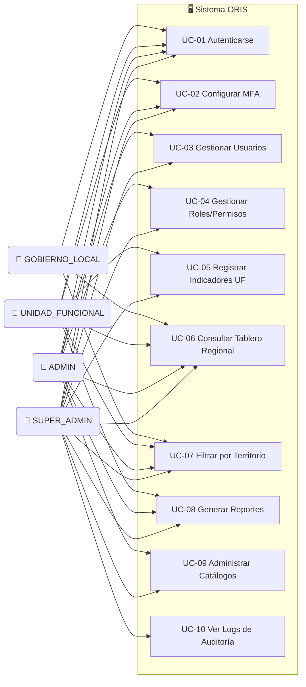

---

### 2.3 UC-01: Autenticarse en el Sistema

**Actores:** SUPER_ADMIN, ADMIN, UNIDAD_FUNCIONAL, GOBIERNO_LOCAL  
**Precondición:** Cuenta activa en el sistema  
**Postcondición:** JWT RS256 emitido — acceso al dashboard

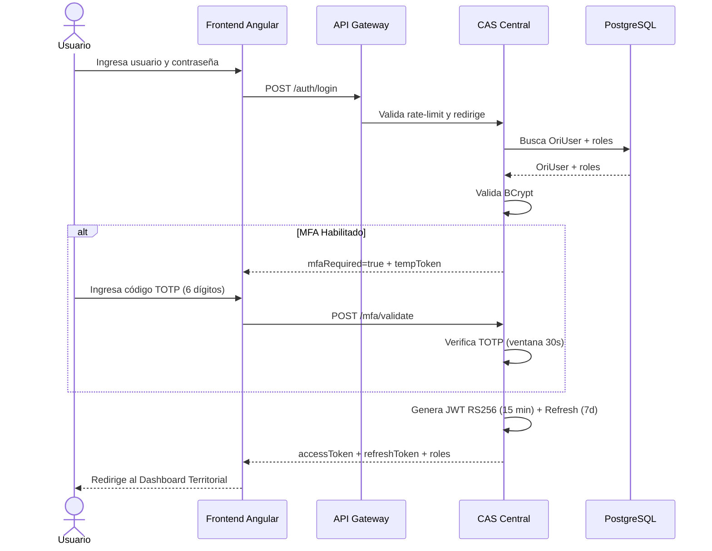

---

### 2.4 UC-02: Configurar MFA (Autenticación Multifactor)

**Actores:** Todos los roles  
**Precondición:** Usuario autenticado con JWT válido  
**Postcondición:** MFA activado en la cuenta

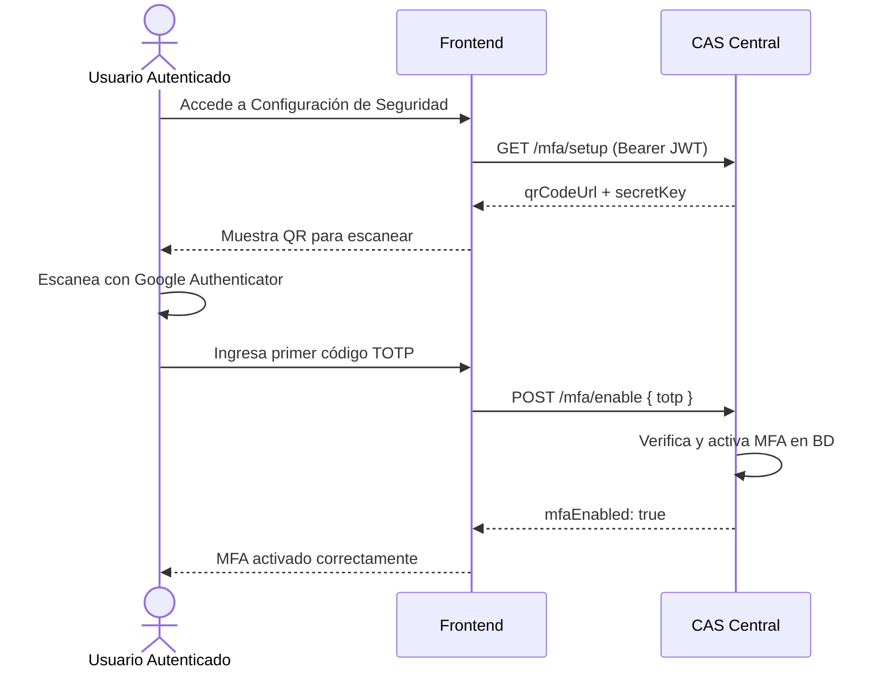

---

### 2.5 UC-03: Gestionar Usuarios

**Actores:** SUPER_ADMIN, ADMIN  
**Precondición:** Permiso `user:create`, `user:read`, `user:update`  
**Postcondición:** Usuario creado/actualizado/desactivado

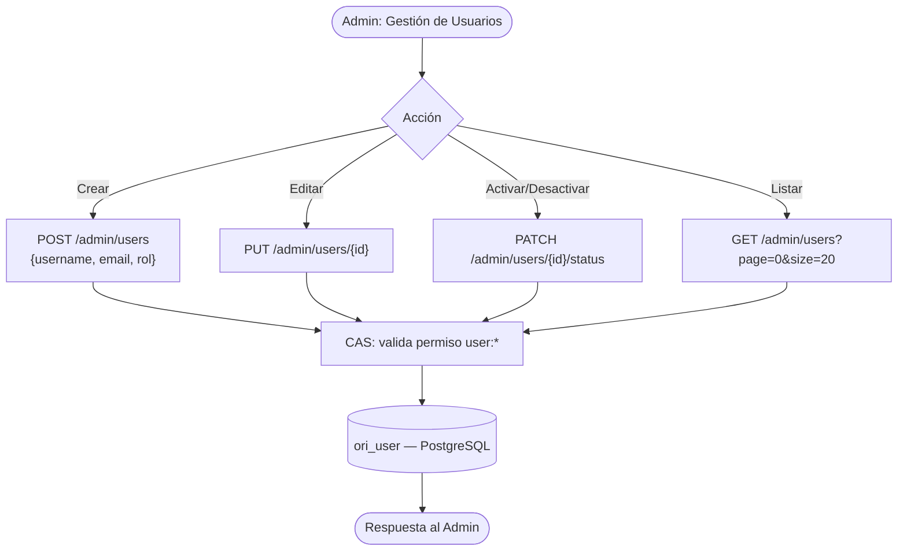

| Operación | SUPER_ADMIN | ADMIN |
|---|---|---|
| Crear usuario | ✅ | ✅ |
| Editar datos | ✅ | ✅ |
| Desactivar | ✅ | ✅ |
| Eliminar | ✅ | ❌ |

---

### 2.6 UC-04: Gestionar Roles y Permisos

**Actores:** SUPER_ADMIN  
**Precondición:** Permiso `role:write`  
**Postcondición:** RBAC actualizado

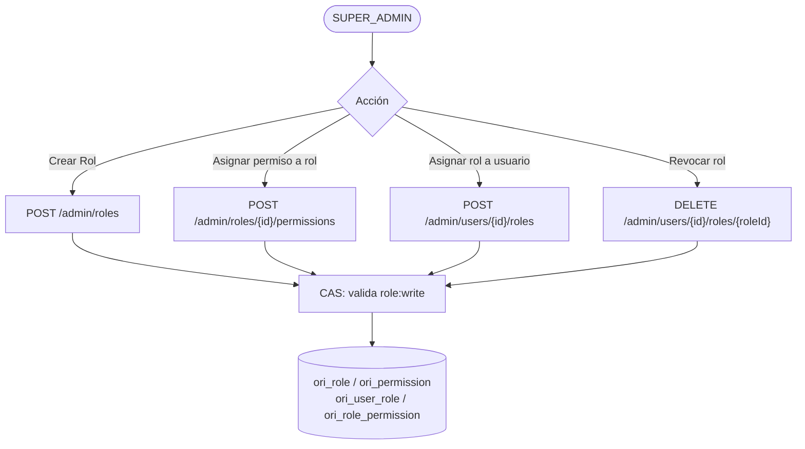

---

### 2.7 UC-05: Registrar Indicadores por Unidad Funcional

**Actores:** UNIDAD_FUNCIONAL  
**Precondición:** Autenticado con permiso `indicator:write` en su UF  
**Postcondición:** Indicador persistido y visible en dashboard

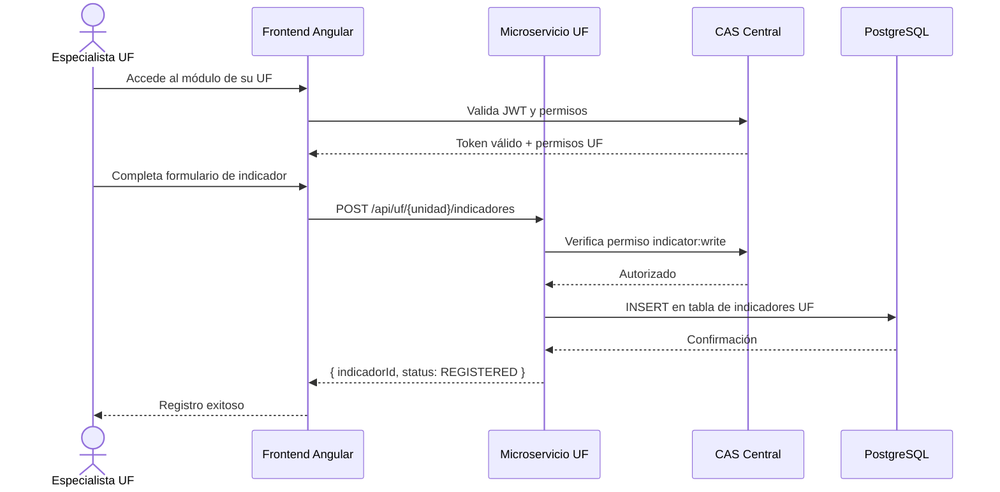

---

### 2.8 UC-06: Consultar Tablero Regional

**Actores:** Todos los roles (vista según permisos)

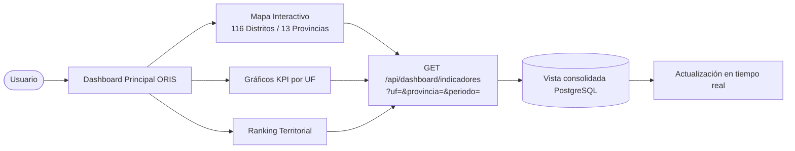

---

### 2.9 UC-07: Filtrar Indicadores por Territorio

**Actores:** Todos los roles

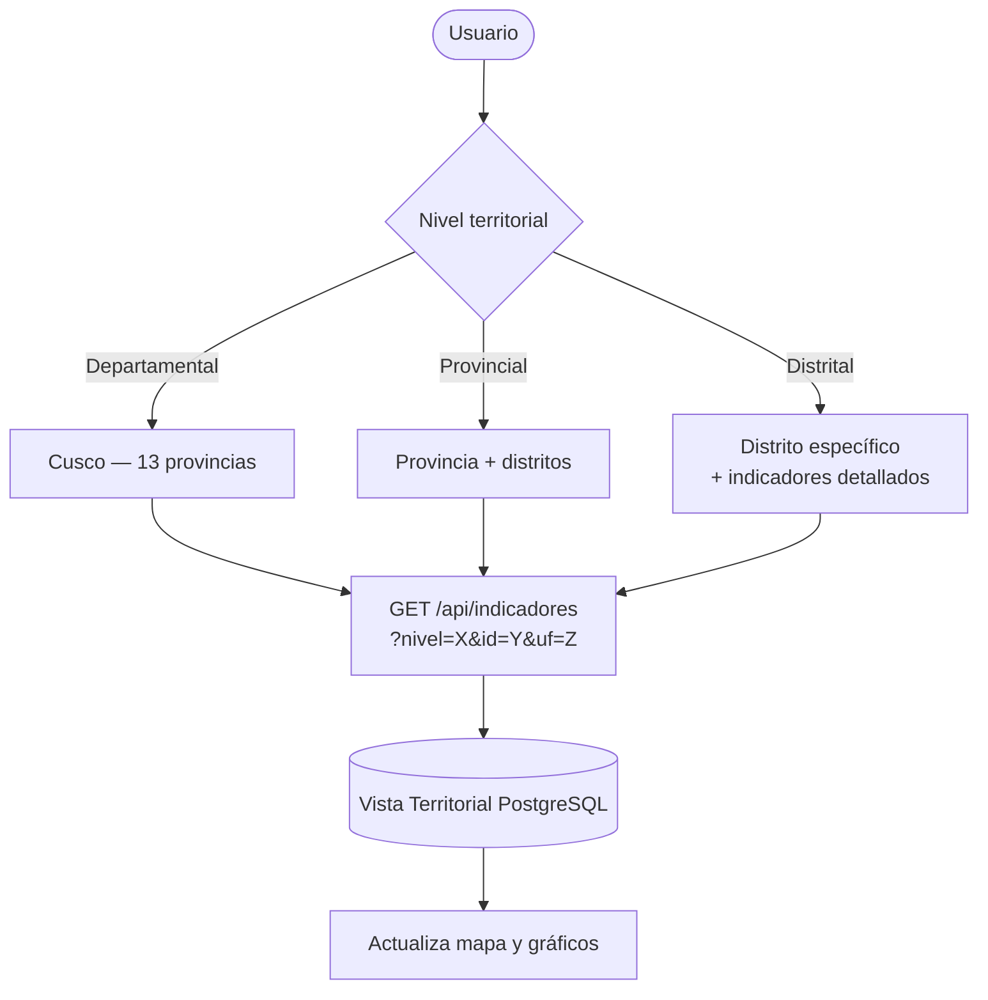

---

### 2.10 UC-08: Generar Reportes

**Actores:** SUPER_ADMIN, ADMIN, UNIDAD_FUNCIONAL  
**Precondición:** Permiso `report:generate`

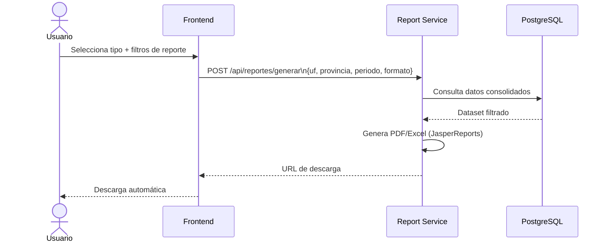

---

### 2.11 UC-09: Administrar Catálogos

**Actores:** SUPER_ADMIN, ADMIN — Permiso `catalog:write`

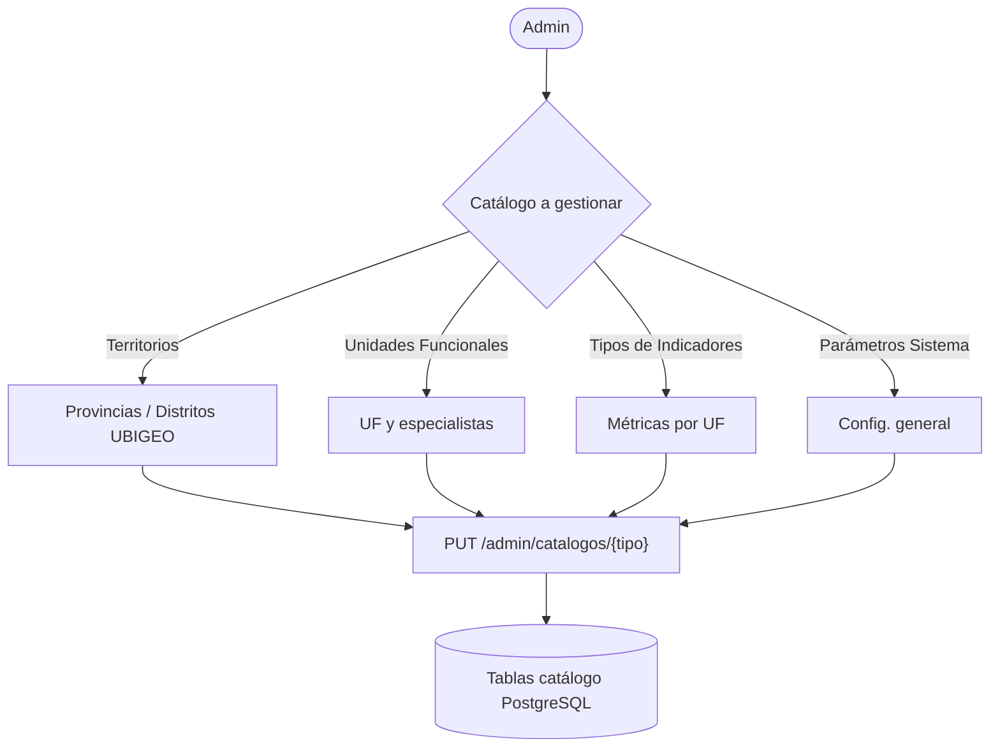

---

### 2.12 UC-10: Ver Logs de Auditoría

**Actores:** SUPER_ADMIN — Permiso `audit:read`

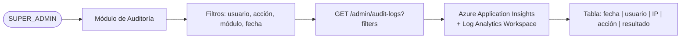

---

### 2.13 Resumen de Casos de Uso por Actor

| Caso de Uso | SUPER_ADMIN | ADMIN | UNIDAD_FUNCIONAL | GOBIERNO_LOCAL |
|---|:---:|:---:|:---:|:---:|
| UC-01 Autenticarse | ✅ | ✅ | ✅ | ✅ |
| UC-02 Configurar MFA | ✅ | ✅ | ✅ | ✅ |
| UC-03 Gestionar Usuarios | ✅ | ✅ | ❌ | ❌ |
| UC-04 Gestionar Roles/Permisos | ✅ | ❌ | ❌ | ❌ |
| UC-05 Registrar Indicadores UF | ✅ | ❌ | ✅ | ❌ |
| UC-06 Consultar Tablero Regional | ✅ | ✅ | ✅ | ✅ |
| UC-07 Filtrar Indicadores Territorio | ✅ | ✅ | ✅ | ✅ |
| UC-08 Generar Reportes | ✅ | ✅ | ✅ | ❌ |
| UC-09 Administrar Catálogos | ✅ | ✅ | ❌ | ❌ |
| UC-10 Ver Logs de Auditoría | ✅ | ❌ | ❌ | ❌ |

---

## 3. METODOLOGÍA SCRUM — BURNDOWN Y SPRINTS {#3-scrum}

### 3.1 Marco de Trabajo Scrum

El proyecto ORIS aplica la metodología **Scrum adaptada al contexto de gobierno digital peruano**, cumpliendo con la NTP-ISO/IEC 12207:2016 y la Directiva N° 03-2023-GR-CUSC/GGR. El trabajo se organiza en **4 Entregables / Hitos** de 25 días cada uno, con sprints internos de 2 semanas, dentro del cronograma de **100 días calendario** (09 de febrero al 18 de mayo de 2026).

#### Equipo Scrum ORIS

| Rol Scrum | Responsable | Dedicación |
|---|---|---|
| **Product Owner** | Gerencia Regional de Inclusión Social | 20% |
| **Scrum Master** | Jefe de Proyecto TI | 100% |
| **Dev Lead Backend** | Arquitecto de Software Senior | 100% |
| **Backend Developer** | Desarrollador Spring Boot | 100% |
| **Frontend Developer** | Desarrollador Angular | 100% |
| **DevOps Engineer** | Especialista Azure/Kubernetes | 80% |
| **QA Engineer** | Especialista en Pruebas | 100% |
| **DBA** | Administrador de Base de Datos | 60% |

#### Ceremonias Scrum

| Ceremonia | Frecuencia | Duración | Participantes |
|---|---|---|---|
| Sprint Planning | Inicio de cada entregable | 4 horas | Todo el equipo + PO |
| Daily Standup | Diario (lunes–viernes) | 15 minutos | Equipo técnico |

---

### 3.2 Cronograma Oficial — 4 Entregables / Hitos

| # | Entregable / Tarea | Días | Inicio | Fin |
|---|---|:---:|---|---|
| **PROYECTO** | **IMPLEMENTACIÓN DEL OBSERVATORIO REGIONAL** | **100** | **09/02/2026** | **18/05/2026** |
| **E1** | **ENTREGABLE 1: ANÁLISIS, DISEÑO Y BASE** | **25** | **09/02/2026** | **05/03/2026** |
| E1.1 | Revisión de Prototipo y Levantamiento de Requerimientos | 4 | 09/02/2026 | 12/02/2026 |
| E1.2 | Diseño de Arquitectura de Software y Modelo de Datos | 4 | 13/02/2026 | 16/02/2026 |
| E1.3 | Desarrollo de Backend Base, Seguridad y Roles (RBAC) | 7 | 17/02/2026 | 23/02/2026 |
| E1.4 | Implementación de Base de Datos y Estructura Frontend | 7 | 24/02/2026 | 02/03/2026 |
| E1.5 | Pruebas Unitarias y Preparación de Código Fuente E1 | 3 | 03/03/2026 | 05/03/2026 |
| 🚩 | **HITO 1: PRIMER ENTREGABLE (Día 25)** | 0 | **05/03/2026** | **05/03/2026** |
| **E2** | **ENTREGABLE 2: CORE DE UNIDADES FUNCIONALES** | **25** | **06/03/2026** | **30/03/2026** |
| E2.1 | Desarrollo Módulos: Mujer, Discapacidad y Niñez | 9 | 06/03/2026 | 14/03/2026 |
| E2.2 | Desarrollo Módulos: Juventudes, Adulto Mayor y Pueblos | 8 | 15/03/2026 | 22/03/2026 |
| E2.3 | Implementación de Mantenimientos y Reportes Operativos | 5 | 23/03/2026 | 27/03/2026 |
| E2.4 | Integración de Módulos y Pruebas Funcionales E2 | 3 | 28/03/2026 | 30/03/2026 |
| 🚩 | **HITO 2: SEGUNDO ENTREGABLE (Día 50)** | 0 | **30/03/2026** | **30/03/2026** |
| **E3** | **ENTREGABLE 3: DASHBOARD Y DOC. PARA GOB. LOCALES** | **25** | **31/03/2026** | **24/04/2026** |
| E3.1 | Desarrollo de Dashboard Gerencial e Indicadores (BI) | 8 | 31/03/2026 | 07/04/2026 |
| E3.2 | Elaboración de Manuales Técnicos y de Usuario | 7 | 08/04/2026 | 14/04/2026 |
| E3.3 | Generación de Guías de Implementación (116 Gob. Locales) | 6 | 15/04/2026 | 20/04/2026 |
| E3.4 | Pruebas de Seguridad (Pentest) y Control de Calidad | 4 | 21/04/2026 | 24/04/2026 |
| 🚩 | **HITO 3: TERCER ENTREGABLE (Día 75)** | 0 | **24/04/2026** | **24/04/2026** |
| **E4** | **ENTREGABLE 4: COMPLEMENTOS Y CIERRE FINAL** | **24** | **25/04/2026** | **18/05/2026** |
| E4.1 | Integración Módulos: DEMUNA, OMAPED, CIAM y ULE | 7 | 25/04/2026 | 01/05/2026 |
| E4.2 | Integración Módulos: PVL, PCA y Otros Complementarios | 7 | 02/05/2026 | 08/05/2026 |
| E4.3 | Capacitación, Transferencia Tecnológica y Manual Final | 5 | 09/05/2026 | 13/05/2026 |
| E4.4 | Despliegue en Producción (Hardening) y Cierre | 5 | 14/05/2026 | 18/05/2026 |
| 🚩 | **HITO 4: CUARTO ENTREGABLE (Día 99–100)** | 1 | **18/05/2026** | **18/05/2026** |

---

### 3.3 Product Backlog — Historias de Usuario por Entregable

| Épica | Historia de Usuario | SP | Entregable |
|---|---|:---:|---|
| **Análisis y Req.** | HU-001: Como PO quiero revisar el prototipo y levantar requerimientos | 5 | **E1** |
| **Arquitectura** | HU-002: Como arquitecto quiero diseñar arquitectura y modelo de datos | 8 | **E1** |
| **CAS Auth** | HU-003: Como funcionario quiero ingresar con JWT RS256 + BCrypt | 8 | **E1** |
| **CAS Auth** | HU-004: Como funcionario quiero activar MFA TOTP en mi cuenta | 5 | **E1** |
| **CAS Auth** | HU-005: Como admin quiero crear y gestionar usuarios con roles | 8 | **E1** |
| **CAS Auth** | HU-006: Como super_admin quiero definir roles y permisos RBAC | 13 | **E1** |
| **BD + Frontend** | HU-007: Como DBA quiero implementar la BD PostgreSQL con Flyway | 8 | **E1** |
| **BD + Frontend** | HU-008: Como dev quiero la estructura base del frontend Angular | 8 | **E1** |
| **QA E1** | HU-009: Como QA quiero ejecutar pruebas unitarias y preparar código E1 | 5 | **E1** |
| **UF Mujer** | HU-010: Como especialista quiero registrar indicadores de género | 8 | **E2** |
| **UF Mujer** | HU-011: Como especialista quiero gestionar fichas de violencia familiar | 5 | **E2** |
| **UF Discapacidad** | HU-012: Como especialista quiero registrar personas con discapacidad | 8 | **E2** |
| **UF NNA** | HU-013: Como especialista quiero registrar indicadores de bienestar infantil | 8 | **E2** |
| **UF Juventud** | HU-014: Como especialista quiero registrar indicadores de empleo juvenil | 8 | **E2** |
| **UF Adulto Mayor** | HU-015: Como especialista quiero registrar adultos en programas CIAM | 8 | **E2** |
| **UF Pueblos** | HU-016: Como especialista quiero registrar comunidades originarias | 8 | **E2** |
| **Mantenimientos** | HU-017: Como admin quiero gestionar catálogos y mantenimientos | 5 | **E2** |
| **Reportes Operativos** | HU-018: Como UF quiero generar reportes básicos por unidad funcional | 8 | **E2** |
| **Integración E2** | HU-019: Como QA quiero integrar módulos y ejecutar pruebas funcionales | 5 | **E2** |
| **Dashboard BI** | HU-020: Como gerente quiero ver dashboard gerencial con indicadores BI | 13 | **E3** |
| **Dashboard BI** | HU-021: Como funcionario quiero mapa interactivo de 116 distritos | 13 | **E3** |
| **Documentación** | HU-022: Como PO quiero manuales técnicos y de usuario | 8 | **E3** |
| **Documentación** | HU-023: Como PO quiero guías de implementación para 116 Gob. Locales | 8 | **E3** |
| **Seguridad** | HU-024: Como cliente quiero pruebas Pentest y control de calidad | 8 | **E3** |
| **DEMUNA/OMAPED** | HU-025: Como especialista quiero integrar módulo DEMUNA | 5 | **E4** |
| **DEMUNA/OMAPED** | HU-026: Como especialista quiero integrar módulo OMAPED | 5 | **E4** |
| **CIAM/ULE** | HU-027: Como especialista quiero integrar módulo CIAM | 5 | **E4** |
| **CIAM/ULE** | HU-028: Como especialista quiero integrar módulo ULE | 5 | **E4** |
| **PVL/PCA** | HU-029: Como especialista quiero integrar módulo PVL (Vaso de Leche) | 5 | **E4** |
| **PVL/PCA** | HU-030: Como especialista quiero integrar módulo PCA (Comp. Alimentaria) | 5 | **E4** |
| **Capacitación** | HU-031: Como PO quiero sesiones de capacitación y transferencia tecnológica | 8 | **E4** |
| **Producción** | HU-032: Como devops quiero desplegar en producción con hardening | 13 | **E4** |

**Total Story Points: 254**

---

### 3.4 Gráfico Gantt Oficial — Cronograma 100 Días

```mermaid
gantt
    title Cronograma ORIS — 100 Días (09/02/2026 al 18/05/2026)
    dateFormat  YYYY-MM-DD
    axisFormat  %d %b

    section E1 — Análisis Diseño y Base (Días 1-25)
    Revisión Prototipo y Levantamiento Req.     :done, e1a, 2026-02-09, 4d
    Diseño Arquitectura y Modelo de Datos       :done, e1b, 2026-02-13, 4d
    Backend Base, Seguridad y Roles RBAC        :done, e1c, 2026-02-17, 7d
    Base de Datos y Estructura Frontend         :done, e1d, 2026-02-24, 7d
    Pruebas Unitarias y Código Fuente E1        :done, e1e, 2026-03-03, 3d
    HITO 1 — Primer Entregable                  :milestone, h1, 2026-03-05, 0d

    section E2 — Core Unidades Funcionales (Días 26-50)
    Módulos: Mujer, Discapacidad y Niñez        :active, e2a, 2026-03-06, 9d
    Módulos: Juventudes, Adulto Mayor y Pueblos :        e2b, 2026-03-15, 8d
    Mantenimientos y Reportes Operativos        :        e2c, 2026-03-23, 5d
    Integración y Pruebas Funcionales E2        :        e2d, 2026-03-28, 3d
    HITO 2 — Segundo Entregable                 :milestone, h2, 2026-03-30, 0d

    section E3 — Dashboard y Doc. Gob. Locales (Días 51-75)
    Dashboard Gerencial e Indicadores BI        :e3a, 2026-03-31, 8d
    Manuales Técnicos y de Usuario              :e3b, 2026-04-08, 7d
    Guías de Implementación 116 Gob. Locales    :e3c, 2026-04-15, 6d
    Pruebas de Seguridad Pentest y QA           :e3d, 2026-04-21, 4d
    HITO 3 — Tercer Entregable                  :milestone, h3, 2026-04-24, 0d

    section E4 — Complementos y Cierre Final (Días 76-100)
    Integración: DEMUNA, OMAPED, CIAM y ULE     :e4a, 2026-04-25, 7d
    Integración: PVL, PCA y Complementarios     :e4b, 2026-05-02, 7d
    Capacitación y Transferencia Tecnológica    :e4c, 2026-05-09, 5d
    Despliegue Producción Hardening y Cierre    :e4d, 2026-05-14, 5d
    HITO 4 — Cuarto Entregable FINAL            :milestone, h4, 2026-05-18, 0d
```

---

### 3.5 Gráfico Burndown — Proyecto ORIS (100 días / 254 Story Points)

El siguiente gráfico muestra la **curva ideal vs. curva real estimada** por entregable:

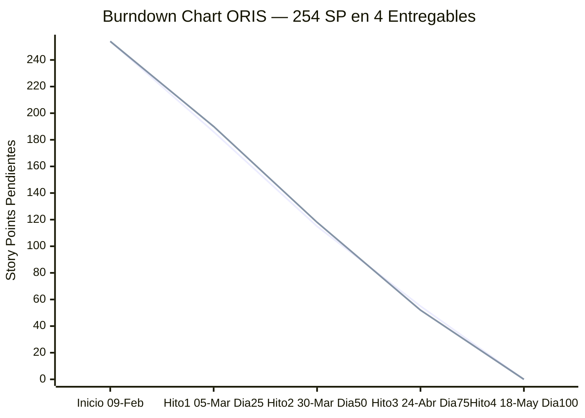

> **Línea 1 (ideal):** Quema constante proporcional por entregable (~63 SP/hito)  
> **Línea 2 (real estimado):** E1 y E2 más intensos (arquitectura + módulos core); E3 y E4 más estables

| Hito | Período | Días | SP del Período | SP Acum. Compl. | SP Restantes |
|---|---|:---:|:---:|:---:|:---:|
| Inicio | — | 0 | — | 0 | 254 |
| **Hito 1** | 09/02 → 05/03/2026 | 25 | 68 | 68 | 186 |
| **Hito 2** | 06/03 → 30/03/2026 | 25 | 71 | 139 | 115 |
| **Hito 3** | 31/03 → 24/04/2026 | 25 | 60 | 199 | 55 |
| **Hito 4** | 25/04 → 18/05/2026 | 24 | 55 | 254 | 0 |

---

### 3.6 Velocidad del Equipo por Entregable

| Entregable | SP Comprometidos | Días | Velocidad (SP/día) | Foco Principal |
|---|:---:|:---:|:---:|---|
| **E1 — Análisis y Base** | 68 | 25 | 2.72 | CAS Auth, Arquitectura, BD, Frontend base |
| **E2 — Core UF** | 71 | 25 | 2.84 | 6 Módulos UF, Mantenimientos, Reportes |
| **E3 — Dashboard y Docs** | 60 | 25 | 2.40 | Dashboard BI, Manuales, Pentest, 116 Gob. Locales |
| **E4 — Complementos** | 55 | 24 | 2.29 | DEMUNA, OMAPED, CIAM, ULE, PVL, PCA, Producción |

---

### 3.7 Definición de "Hecho" (Definition of Done)

Una Historia de Usuario se considera **DONE** cuando cumple todos los criterios:

- [ ] Código desarrollado siguiendo Clean Architecture (Domain / Application / Infrastructure)
- [ ] Tests unitarios con cobertura ≥ 80% (JUnit 5 + Mockito)
- [ ] Tests de integración pasando en entorno Dev
- [ ] API documentada en OpenAPI 3.0 (`openapi.yml` actualizado)
- [ ] Pipeline CI/CD ejecutado sin errores (GitHub Actions)
- [ ] Desplegado en ambiente Dev/Cert en AKS
- [ ] Revisión de hito aprobada por el Product Owner
- [ ] Sin deuda técnica crítica (SonarQube: A en Reliability y Security)

---

## 4. MATRIZ DE ROLES Y ACCESOS {#4-roles-accesos}

### 4.1 Definición de Roles

| Rol | Código | Descripción | Alcance |
|---|---|---|---|
| **Super Administrador** | `SUPER_ADMIN` | Control total del sistema | Global |
| **Administrador** | `ADMIN` | Gestión funcional de la plataforma | Global |
| **Especialista Unidad Funcional** | `UNIDAD_FUNCIONAL` | Operación de su módulo UF | Por UF asignada |
| **Gobierno Local** | `GOBIERNO_LOCAL` | Consulta de indicadores de su territorio | Por distrito/provincia |

---

### 4.2 Matriz de Permisos Granulares

| Permiso | SUPER_ADMIN | ADMIN | UNIDAD_FUNCIONAL | GOBIERNO_LOCAL |
|---|:---:|:---:|:---:|:---:|
| `user:create` | ✅ | ✅ | ❌ | ❌ |
| `user:read` | ✅ | ✅ | ❌ | ❌ |
| `user:update` | ✅ | ✅ | ❌ | ❌ |
| `user:delete` | ✅ | ❌ | ❌ | ❌ |
| `role:write` | ✅ | ❌ | ❌ | ❌ |
| `role:read` | ✅ | ✅ | ❌ | ❌ |
| `permission:read` | ✅ | ✅ | ❌ | ❌ |
| `indicator:write` | ✅ | ❌ | ✅ | ❌ |
| `indicator:read` | ✅ | ✅ | ✅ | ✅ |
| `indicator:delete` | ✅ | ❌ | ❌ | ❌ |
| `dashboard:read` | ✅ | ✅ | ✅ | ✅ |
| `dashboard:territorial` | ✅ | ✅ | ✅ | ✅ (solo su territorio) |
| `report:generate` | ✅ | ✅ | ✅ | ❌ |
| `report:export` | ✅ | ✅ | ✅ | ❌ |
| `catalog:write` | ✅ | ✅ | ❌ | ❌ |
| `catalog:read` | ✅ | ✅ | ✅ | ✅ |
| `audit:read` | ✅ | ❌ | ❌ | ❌ |
| `mfa:manage` | ✅ | ✅ | ✅ | ✅ |
| `system:config` | ✅ | ❌ | ❌ | ❌ |

---

### 4.3 Matriz de Acceso por Módulo/Vista

| Módulo / Vista | Ruta Frontend | SUPER_ADMIN | ADMIN | UNIDAD_FUNCIONAL | GOBIERNO_LOCAL |
|---|---|:---:|:---:|:---:|:---:|
| **Login** | `/auth/login` | ✅ | ✅ | ✅ | ✅ |
| **Configurar MFA** | `/auth/mfa/setup` | ✅ | ✅ | ✅ | ✅ |
| **Dashboard Regional** | `/dashboard` | R/W | R/W | R | R |
| **Mapa Territorial** | `/dashboard/mapa` | R | R | R | R (su territorio) |
| **Filtros Indicadores** | `/dashboard/filtros` | ✅ | ✅ | ✅ | ✅ (limitado) |
| **Gestión de Usuarios** | `/admin/usuarios` | C/R/U/D | C/R/U | ❌ | ❌ |
| **Gestión de Roles** | `/admin/roles` | C/R/U/D | R | ❌ | ❌ |
| **Módulo UF Mujer** | `/uf/mujer` | R/W | R | R/W (solo UF=Mujer) | ❌ |
| **Módulo UF Discapacidad** | `/uf/discapacidad` | R/W | R | R/W (solo UF=Disc.) | ❌ |
| **Módulo UF Niño/Adolesc.** | `/uf/nino-adolescente` | R/W | R | R/W (solo UF=NNA) | ❌ |
| **Módulo UF Juventud** | `/uf/juventud` | R/W | R | R/W (solo UF=Juv.) | ❌ |
| **Módulo UF Adulto Mayor** | `/uf/adulto-mayor` | R/W | R | R/W (solo UF=AM) | ❌ |
| **Módulo UF Pueblos** | `/uf/pueblos-indigenas` | R/W | R | R/W (solo UF=PI) | ❌ |
| **Reportes — Generación** | `/reportes/generar` | ✅ | ✅ | ✅ | ❌ |
| **Reportes — Descarga** | `/reportes/descargar` | ✅ | ✅ | ✅ | ❌ |
| **Administración — Catálogos** | `/admin/catalogos` | C/R/U/D | C/R/U | R | ❌ |
| **Administración — Parámetros** | `/admin/parametros` | ✅ | ❌ | ❌ | ❌ |
| **Logs de Auditoría** | `/admin/auditoria` | ✅ | ❌ | ❌ | ❌ |
| **Perfil de Usuario** | `/perfil` | ✅ | ✅ | ✅ | ✅ |

> **Leyenda:** R = Solo Lectura | R/W = Lectura y Escritura | C/R/U/D = Crear/Leer/Actualizar/Eliminar | ❌ = Sin acceso

---

### 4.4 Matriz de Acceso a Endpoints REST (API)

| Endpoint | Método | SUPER_ADMIN | ADMIN | UNIDAD_FUNCIONAL | GOBIERNO_LOCAL |
|---|---|:---:|:---:|:---:|:---:|
| `/auth/login` | POST | ✅ | ✅ | ✅ | ✅ |
| `/auth/refresh` | POST | ✅ | ✅ | ✅ | ✅ |
| `/mfa/setup` | GET | ✅ | ✅ | ✅ | ✅ |
| `/mfa/enable` | POST | ✅ | ✅ | ✅ | ✅ |
| `/admin/users` | GET | ✅ | ✅ | ❌ | ❌ |
| `/admin/users` | POST | ✅ | ✅ | ❌ | ❌ |
| `/admin/users/{id}` | PUT | ✅ | ✅ | ❌ | ❌ |
| `/admin/users/{id}` | DELETE | ✅ | ❌ | ❌ | ❌ |
| `/admin/users/{id}/status` | PATCH | ✅ | ✅ | ❌ | ❌ |
| `/admin/roles` | POST | ✅ | ❌ | ❌ | ❌ |
| `/admin/roles/{id}/permissions` | POST | ✅ | ❌ | ❌ | ❌ |
| `/api/dashboard/indicadores` | GET | ✅ | ✅ | ✅ | ✅ |
| `/api/uf/{unidad}/indicadores` | GET | ✅ | ✅ | ✅ | ✅ |
| `/api/uf/{unidad}/indicadores` | POST | ✅ | ❌ | ✅ (propia UF) | ❌ |
| `/api/uf/{unidad}/indicadores/{id}` | DELETE | ✅ | ❌ | ❌ | ❌ |
| `/api/reportes/generar` | POST | ✅ | ✅ | ✅ | ❌ |
| `/admin/catalogos/{tipo}` | PUT | ✅ | ✅ | ❌ | ❌ |
| `/admin/audit-logs` | GET | ✅ | ❌ | ❌ | ❌ |

---

### 4.5 Flujo de Control de Acceso (RBAC + JWT)

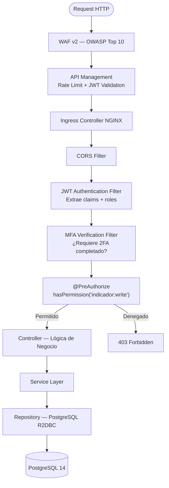

---

## APÉNDICE — GLOSARIO

| Término | Definición |
|---|---|
| **AKS** | Azure Kubernetes Service — plataforma de contenedores gestionada |
| **APIM** | Azure API Management — gateway centralizado de APIs |
| **BCrypt** | Algoritmo de hashing para almacenamiento seguro de contraseñas |
| **CAS** | Central Authentication Service — microservicio de autenticación ORIS |
| **CIAM** | Centro Integral de Atención al Adulto Mayor |
| **CONADIS** | Consejo Nacional para la Integración de la Persona con Discapacidad |
| **DEMUNA** | Defensoría Municipal del Niño y del Adolescente |
| **HPA** | Horizontal Pod Autoscaler — escalado automático en Kubernetes |
| **JWT RS256** | JSON Web Token con firma asimétrica RSA-2048 bits |
| **MFA TOTP** | Autenticación multifactor basada en código temporal (30 segundos) |
| **OMAPED** | Oficina Municipal de Atención a la Persona con Discapacidad |
| **PCA** | Programa de Complementación Alimentaria |
| **PVL** | Programa del Vaso de Leche |
| **R2DBC** | Reactive Relational Database Connectivity — acceso reactivo a BD |
| **RBAC** | Role-Based Access Control — control de acceso basado en roles |
| **TLS 1.3** | Transport Layer Security versión 1.3 — cifrado en tránsito |
| **UF** | Unidad Funcional — una de las 6 áreas específicas del ORIS |
| **ULE** | Unidad Local de Empadronamiento |
| **WAF** | Web Application Firewall — protección contra ataques web |

---

*Documento elaborado para el Gobierno Regional de Cusco — Gerencia de Inclusión Social, Mujer y Poblaciones Vulnerables.*  
*Cumple con: NTP-ISO/IEC 12207:2016 | Ley 29733 | Directiva N° 03-2023-GR-CUSC/GGR*
