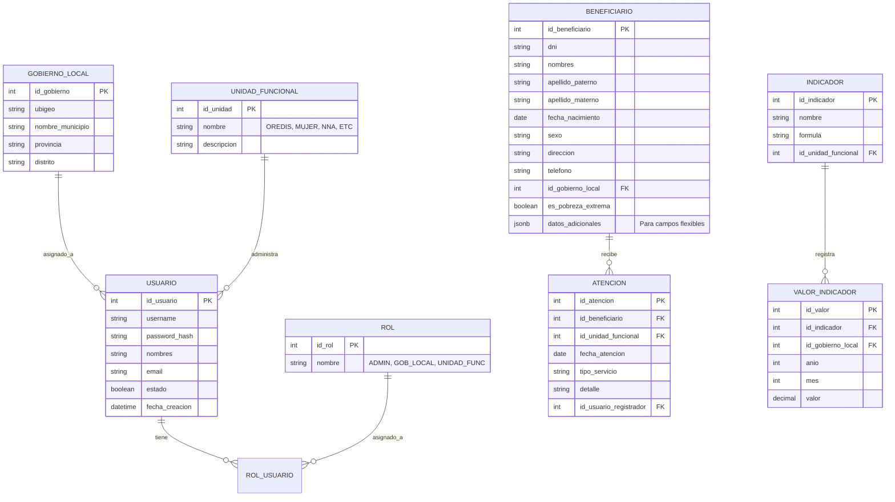

# Modelo de Datos: Observatorio Regional de Inclusión Social

## 1. Introducción
Este documento define la estructura de datos para el Observatorio Regional. Se utilizará **PostgreSQL** como motor de base de datos relacional principal debido a su robustez y soporte para datos geoespaciales (PostGIS) si fuera necesario en el futuro.

## 2. Diagrama Entidad-Relación (Nivel Lógico)

## 3. Diccionario de Datos (Tablas Principales)

### 3.1 Esquema de Seguridad (`seguridad`)

| Tabla | Descripción |
| :--- | :--- |
| `seg_usuario` | Almacena las credenciales y datos básicos de los usuarios del sistema. |
| `seg_rol` | Catálogo de roles (Administrador, Operador GL, Operador UF, Consulta). |
| `seg_usuario_rol` | Tabla pivote para asignar uno o más roles a un usuario. |

### 3.2 Esquema Maestro (`maestros`)

| Tabla | Descripción |
| :--- | :--- |
| `mae_ubigeo` | Catálogo oficial de departamentos, provincias y distritos (INEI). |
| `mae_gobierno_local` | Registro de las 116 municipalidades. Vinculado al Ubigeo. |
| `mae_unidad_funcional` | Catálogo de las 06 unidades (Mujer, OREDIS, NNA, etc.). |

### 3.3 Esquema Operativo (`operativo`)

Este esquema contendrá las tablas transaccionales. Se empleará el uso de **Tablas Particionadas** o **Esquemas por Unidad** si el volumen de datos es muy alto, pero inicialmente se manejará un modelo centralizado con discriminadores.

#### Tabla: `ope_beneficiario`
Centraliza el Padrón de beneficiarios.
- **Clave Primaria:** `id_beneficiario`
- **Índices:** `dni` (Unique), `apellido_paterno`, `id_gobierno_local`.
- **Nota:** Se usará un campo `jsonb` llamado `datos_socioeconomicos` para almacenar variables que cambian según la ficha de cada unidad funcional (ej. tipo de discapacidad para OREDIS, grado de instrucción para Juventudes).

#### Tabla: `ope_atencion`
Registra cada intervención o servicio brindado.
- **FKs:** `id_beneficiario`, `id_unidad_funcional`.
- **Ejemplos:** Entrega de carnet CONADIS, Atención psicológica, Participación en taller.

#### Tabla: `ope_reporte_mensual`
Tabla agregada para almacenar los cierres de información que envían los Gobiernos Locales mensualmente (si aplica reporte manual).

## 4. Consideraciones de Auditoría

Todas las tablas transaccionales incluirán los siguientes campos de auditoría estándar:
- `aud_usuario_creacion` (ID Usuario)
- `aud_fecha_creacion` (Timestamp)
- `aud_usuario_modificacion` (ID Usuario, Nullable)
- `aud_fecha_modificacion` (Timestamp, Nullable)
- `aud_ip_origen` (VARCHAR, IP del cliente)

## 5. Migraciones

Se utilizará **Flyway** o **Liquibase** para el control de versiones de la base de datos, asegurando que los scripts se ejecuten en orden y sean reproducibles en todos los ambientes.
